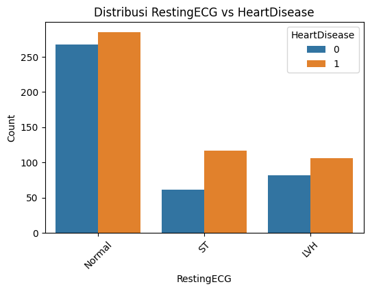

# Laporan Proyek Machine Learning

**Nama: Mohammad Rafli Sumaryono**

## **Domain Proyek**

Penyakit jantung (kardiovaskular) merupakan penyebab kematian utama secara global, menyumbang **17,9 juta kematian per tahun** menurut [WHO, 2021](<https://www.who.int/news-room/fact-sheets/detail/cardiovascular-diseases-(cvds)>). Di Indonesia, berdasarkan [Riset Kesehatan Dasar (Riskesdas) 2018](https://sehatnegeriku.kemkes.go.id/baca/rilis-media/20220929/0541166/penyakit-jantung-penyebab-utama-kematian-kemenkes-perkuat-layanan-primer/), penyakit jantung berkontribusi terhadap **15% dari total kematian**. Penelitian oleh [Roth et al. (2020)](<https://www.thelancet.com/journals/lancet/article/PIIS0140-6736(20)30752-2/fulltext>) di _The Lancet_ menegaskan bahwa penyakit jantung koroner (PJK) adalah penyebab utama kematian di negara berkembang.

### **Tantangan Diagnosis**

- **Gejala tidak spesifik**: Nyeri dada dapat disebabkan oleh berbagai faktor.
- **Biaya pemeriksaan mahal**: Angiografi bisa mencapai Rp 15-20 juta.
- **Keterbatasan tenaga ahli**: Khususnya di daerah terpencil.

### **Manfaat Proyek**

- **Deteksi dini**: Mengidentifikasi pasien berisiko tinggi sejak awal.
- **Penghematan biaya**: Hingga 40% dibandingkan metode konvensional.
- **Akses merata**: Mendukung integrasi dengan sistem kesehatan digital.

---

## **Business Understanding**

### **Problem Statement**

Penyakit jantung adalah ancaman kesehatan global yang memerlukan deteksi dini untuk mencegah komplikasi dan mengurangi angka kematian. Namun, diagnosis sering kali bergantung pada pemeriksaan medis yang mahal dan kompleks. Dataset _Heart Disease_ berisi parameter medis dan karakteristik pasien, seperti usia, tekanan darah, kolesterol, dan hasil tes klinis. Permasalahan utama yang diatasi adalah:  
_"Seberapa baik model machine learning dapat memprediksi risiko penyakit jantung berdasarkan kombinasi parameter medis dan karakteristik pasien?"_  
Solusi ini bertujuan mendukung pencegahan dini, perawatan cepat, dan pengambilan keputusan medis berbasis data.

### **Goals**

- Membangun model klasifikasi untuk memprediksi risiko penyakit jantung.
- Mengidentifikasi faktor-faktor utama yang memengaruhi risiko penyakit jantung melalui analisis fitur.

### **Solution Statements**

- **Solusi 1 (Baseline):** Menggunakan algoritma Logistic Regression untuk klasifikasi biner, dipilih karena sederhana dan mudah diinterpretasikan.
- **Metrik Evaluasi:** Menilai performa model dengan **Akurasi, Precision, Recall, F1-score, dan AUC** untuk memastikan keandalan prediksi.

---

## **Data Understanding**

### **Pengantar Pembahasan Informasi Data**

Tahap ini bertujuan untuk memahami karakteristik dataset _Heart Disease_ melalui analisis dan visualisasi. Fokusnya adalah mengidentifikasi pola, distribusi, anomali, dan hubungan antar fitur yang relevan untuk prediksi penyakit jantung.

### **URL/Tautan Sumber Data**

Dataset diambil dari: [Heart Failure Prediction Dataset](https://www.kaggle.com/datasets/fedesoriano/heart-failure-prediction)

### **Jumlah Baris dan Kolom**

- **Jumlah Baris:** 918 sampel (data pasien).
- **Jumlah Kolom:** 12 kolom (11 fitur + 1 target: `HeartDisease`).  
  Dataset ini mencakup parameter klinis dan gaya hidup yang berkaitan dengan kesehatan jantung.

### **Kondisi Data**

- **Missing Values:** Tidak ada nilai hilang (NaN) secara eksplisit berdasarkan pemeriksaan awal. Namun, nilai 0 pada fitur `Cholesterol` dan `RestingBP` dianggap tidak valid secara medis, mengindikasikan potensi data hilang.
- **Duplikat:** Tidak ada nilai duplicate .
- **Outlier dan Anomali:**
  - `Cholesterol`: Nilai 0 tidak mungkin secara medis, kemungkinan data salah.
  - `RestingBP`: Nilai 0 juga tidak logis, menandakan anomali.
  - `Oldpeak`: Nilai negatif (misalnya -2,6) tidak wajar secara klinis.
  - Boxplot menunjukkan nilai ekstrim pada `Cholesterol`, `RestingBP`, dan `Oldpeak` di luar rentang normal.

### **Uraian Seluruh Fitur pada Data**

| Fitur          | Tipe      | Deskripsi                                                                                                     |
| -------------- | --------- | ------------------------------------------------------------------------------------------------------------- |
| Age            | Numerik   | Usia pasien (tahun)                                                                                           |
| Sex            | Kategorik | Jenis kelamin (M: Male, F: Female)                                                                            |
| ChestPainType  | Kategorik | Tipe nyeri dada (TA: Typical Angina, ATA: Atypical Angina, NAP: Non-Anginal Pain, ASY: Asymptomatic)          |
| RestingBP      | Numerik   | Tekanan darah saat istirahat (mmHg)                                                                           |
| Cholesterol    | Numerik   | Kadar kolesterol serum (mg/dL)                                                                                |
| FastingBS      | Kategorik | Gula darah puasa (> 120 mg/dL = 1, ≤ 120 mg/dL = 0)                                                           |
| RestingECG     | Kategorik | Hasil elektrokardiogram saat istirahat (Normal, ST: ST-T wave abnormality, LVH: Left ventricular hypertrophy) |
| MaxHR          | Numerik   | Detak jantung maksimum yang dicapai (bpm)                                                                     |
| ExerciseAngina | Kategorik | Angina akibat olahraga (Y: Yes, N: No)                                                                        |
| Oldpeak        | Numerik   | Depresi ST akibat olahraga relatif terhadap istirahat                                                         |
| ST_Slope       | Kategorik | Kemiringan(segmen ST saat olahraga (Up: upsloping, Flat, Down: downsloping)                                   |
| HeartDisease   | Kategorik | Target: Diagnosis penyakit jantung (0 = sehat, 1 = sakit)                                                     |

### **Insight dari Eksplorasi dan Visualisasi**

1.  **Distribusi Target:**
    - Kolom `HeartDisease` menunjukkan proporsi kelas [ISI NILAI DI SINI] (misalnya: ~55% pasien terdiagnosis sakit (1), 45% sehat (0), periksa dari countplot).
    - Dataset relatif seimbang, tidak memerlukan teknik penanganan ketidakseimbangan kelas.
2.  **Fitur Numerik:**
    - **Age:** Rata-rata 53.51 tahun, mayoritas antara 54 tahun.
    - **RestingBP:** Rata-rata 132.40 mmHg, agak tinggi, dengan nilai 0 sebagai anomali.
    - **Cholesterol:** Rata-rata 198.80 mg/dL, nilai 0 menunjukkan data salah.
    - **MaxHR:** Rata-rata 136.81 bpm, rentang 120-140 bpm menunjukkan variasi besar.
    - **Oldpeak:** Rata-rata 0.89 , nilai negatif (misalnya -2 tidak wajar).
3.  **Fitur Kategorik:**
     
    - Pasien Berjenis kelamin Laki-laki Lebih berpotensi mengalami serangan jantung dibandingkan pasien Wanita


    


  - Pasien dengan `ChestPainType` ASY (asymptomatic) cenderung memiliki risiko tinggi sekitar 79% positif terkena serangan jantung.
    
    - Pasien Dengan`FastingBS`/ Gula darah puasa (> 120 mg/dL ) 48% berpotensi terkena serangan jantung ,Sedangakan Pasien dengan Gula darah puasa (≤ 120 mg/dL ) 79% terkena serangan jantung.

    
    RestingECG	Kategorik	Hasil elektrokardiogram saat istirahat (Normal, ST: ST-T wave abnormality, LVH: Left ventricular hypertrophy)

    - Pasien denagan RestingECG 
      ```
                    Sehat     Serangan jantung
      LVH           43%             57%
      Normal        48%             52%
      ST            34%             66%
   
   
   - `ExerciseAngina` = Y berkorelasi kuat dengan penyakit jantung 85%.

   
   - `ST_Slope Flat Memiliki potensi jauh lebih tinggi dibandingakn dengan upsloping maupun downsloping 
```

Persentase HeartDisease per kategori:

Persentase HeartDisease per kategori Sex:
HeartDisease          0          1
Sex                               
F             74.093264  25.906736
M             36.827586  63.172414

Persentase HeartDisease per kategori ChestPainType:
HeartDisease           0          1
ChestPainType                      
ASY            20.967742  79.032258
ATA            86.127168  13.872832
NAP            64.532020  35.467980
TA             56.521739  43.478261

Persentase HeartDisease per kategori FastingBS:
HeartDisease          0          1
FastingBS                         
0             51.988636  48.011364
1             20.560748  79.439252

Persentase HeartDisease per kategori RestingECG:
HeartDisease          0          1
RestingECG                        
LVH           43.617021  56.382979
Normal        48.369565  51.630435
ST            34.269663  65.730337

Persentase HeartDisease per kategori ExerciseAngina:
HeartDisease            0          1
ExerciseAngina                      
N               64.899452  35.100548
Y               14.824798  85.175202

Persentase HeartDisease per kategori ST_Slope:
HeartDisease          0          1
ST_Slope                          
Down          22.222222  77.777778
Flat          17.173913  82.826087
Up            80.253165  19.746835

```
---
4.  **Korelasi:**

    - Korelasi positif kuat: `Oldpeak` vs `HeartDisease` .
    - Korelasi negatif kuat: `MaxHR` vs `HeartDisease` .


## **Data Preparation**

Pada tahap ini, data diproses agar siap untuk pemodelan machine learning. Langkah-langkahnya adalah sebagai berikut:

### **1. Penanganan Nilai Tidak Valid**

- **Cholesterol:** Nilai 0 tidak mungkin secara medis, diganti dengan NaN.
- **RestingBP:** Nilai 0 tidak logis, diganti dengan NaN.
- **Oldpeak:** Nilai negatif tidak wajar, di-clip ke minimum 0.
- Tujuannya: Memastikan data konsisten dengan domain medis.

### **2. Imputasi Missing Values**

- Nilai NaN pada fitur numerik (`Age`, `RestingBP`, `Cholesterol`, `MaxHR`, `Oldpeak`) diisi dengan strategi **median**.
- Median dipilih karena lebih tahan terhadap outlier dibandingkan mean.
- Tujuannya: Menghilangkan nilai hilang tanpa mengubah distribusi data.

### **3. Penanganan Outlier**

- Outlier pada fitur numerik ditangani dengan **clipping berbasis domain medis**:
  - `Age`: Di-clip ke rentang [30, 100].
  - `RestingBP`: Di-clip ke rentang [80, 200].
  - `Cholesterol`: Di-clip ke rentang [100, 400].
  - `MaxHR`: Di-clip ke rentang [60, 220].
  - `Oldpeak`: Di-clip ke rentang [0, 4].
- Tujuannya: Mengurangi dampak nilai ekstrim sambil mempertahankan data yang mungkin valid secara medis.

### **4. Encoding Fitur Kategorikal**

- Fitur kategorikal (`Sex`, `ChestPainType`, `FastingBS`, `RestingECG`, `ExerciseAngina`, `ST_Slope`) diubah menjadi numerik menggunakan **one-hot encoding**.
- Parameter `drop_first=True` digunakan untuk menghindari multicollinearity.
- Hasil: Kolom dummy baru (misalnya `Sex_M`, `ChestPainType_ATA`).

### **5. Pembagian Data (Train-Test Split)**

- Data dibagi menjadi:
  - **Data Latih:** 80% untuk melatih model.
  - **Data Uji:** 20% untuk evaluasi.
- Parameter `stratify=y` menjaga proporsi kelas target (`HeartDisease`).
- Parameter `random_state=42` memastikan hasil konsisten.

### **6. Standarisasi Fitur Numerik**

- Fitur numerik (`Age`, `RestingBP`, `Cholesterol`, `MaxHR`, `Oldpeak`) distandarisasi menggunakan **StandardScaler**.
- Data diubah ke skala mean=0 dan standar deviasi=1.
- Scaler dilatih pada data latih dan diterapkan pada data uji untuk mencegah data leakage.

### **7. Dataset Siap untuk Pemodelan**

- Fitur numerik telah distandarisasi.
- Fitur kategorikal telah diencode.
- Data terbagi menjadi data latih dan uji, siap untuk pelatihan model.

---

## **Modeling**

### **1. Inisialisasi Model**

- Model yang digunakan adalah **Logistic Regression**, dipilih karena sederhana, interpretatif, dan cocok untuk klasifikasi biner.
- **Parameter:**
  - `max_iter=1000`: Memastikan model konvergen.
  - `random_state=42`: Menjaga konsistensi hasil.
  - `class_weight='balanced'`: Menangani potensi ketidakseimbangan kelas.
- **Cara Kerja Logistic Regression:**
  - Model ini memprediksi probabilitas kelas (0 atau 1) menggunakan fungsi sigmoid.
  - Fitur diolah menjadi log-odds, lalu diubah ke probabilitas dengan rumus:  
    $$ P(y=1) = \frac{1}{1 + e^{-(\beta_0 + \beta_1x_1 + \beta_2x_2 + ...)}} $$
  - Model menentukan batas keputusan untuk mengklasifikasikan data ke kelas 0 (sehat) atau 1 (sakit).

### **2. Training Model**

- Model dilatih menggunakan data latih (`X_train`, `y_train`).
- Proses ini menghasilkan koefisien untuk setiap fitur, yang digunakan untuk prediksi.

### **3. Prediksi**

- **Prediksi Kelas (`y_pred`):** Model memprediksi kelas biner (0 atau 1) pada data uji.
- **Probabilitas Kelas (`y_proba`):** Model menghitung probabilitas untuk kelas positif (1), berguna untuk analisis threshold.

---

## **Evaluasi Model**

### **1. Akurasi (Accuracy)**

- Akurasi mengukur proporsi prediksi benar dari total prediksi:
  $$
  \text{Accuracy} = \frac{\text{Jumlah Prediksi Benar}}{\text{Total Prediksi}}
  $$
- Hasil:
  ```
  Accuracy: [ISI NILAI DI SINI]
  ```

### **2. Classification Report**

- **Precision:** Proporsi prediksi positif yang benar.
- **Recall:** Proporsi aktual positif yang dikenali.
- **F1-score:** Harmoni antara precision dan recall.
- Hasil:
  ```
  [ISI NILAI DI SINI]
  ```
  _(Salin output dari `print(classification_report(y_test, y_pred))` di sini, termasuk precision, recall, f1-score, dan support untuk setiap kelas)._

### **3. Confusion Matrix**

- Visualisasi matriks kebingungan menunjukkan:
  - True Positives (TP), True Negatives (TN), False Positives (FP), False Negatives (FN).
- Hasil membantu analisis kesalahan model.  
  

### **4. ROC Curve dan AUC Score**

- Kurva ROC menunjukkan trade-off antara True Positive Rate (TPR) dan False Positive Rate (FPR).
- AUC (Area Under Curve) mendekati 1 menandakan performa baik.
- Hasil:
  $$
  \text{AUC Score} = [ISI NILAI DI SINI]
  $$
  _(Isi nilai AUC dari output `roc_auc_score(y_test, y_proba)` di sini)._  
  

### **5. Feature Importance**

- Koefisien absolut dari model menunjukkan fitur paling berpengaruh.
- Visualisasi 10 fitur teratas membantu interpretasi faktor risiko penyakit jantung.  
  

---

## **Inference**

### **Data Uji Baru**

Data baru untuk simulasi prediksi:

| Fitur          | Nilai  |
| -------------- | ------ |
| Age            | 58     |
| RestingBP      | 140    |
| Cholesterol    | 289    |
| FastingBS      | 0      |
| MaxHR          | 160    |
| Oldpeak        | 1.2    |
| Sex            | M      |
| ChestPainType  | ATA    |
| RestingECG     | Normal |
| ExerciseAngina | N      |
| ST_Slope       | Up     |

- Data diproses: Encoding untuk fitur kategorikal, standarisasi untuk fitur numerik.

### **Hasil Prediksi**

- **Prediksi Risiko Penyakit Jantung:**
  ```
  [ISI NILAI DI SINI]
  ```
  _(Isi dengan hasil dari kode, misalnya: "Penyakit Jantung" atau "Tidak Ada Penyakit Jantung")._
- **Probabilitas Prediksi:**
  - **Positif (Penyakit Jantung):** [ISI NILAI DI SINI]%
  - **Negatif (Tidak Ada Penyakit Jantung):** [ISI NILAI DI SINI]%  
    _(Isi nilai probabilitas dari output `model.predict_proba(new_data)[:, 1]` di sini, misalnya: 85.73% untuk positif, 14.27% untuk negatif)._

### **Catatan**

- Proses inference menunjukkan model dapat memprediksi risiko penyakit jantung pada data baru.
- Hasil probabilitas mendukung pengambilan keputusan klinis untuk pencegahan dan penanganan.

---

### **Bagian yang Perlu Kamu Isi**

Berikut adalah daftar placeholder yang perlu kamu isi dengan nilai pasti berdasarkan output kode setelah menjalankannya:

1. **Data Understanding**

   - **Kondisi Data:**
     - Duplikat: `[ISI NILAI DI SINI]` (Jalankan `df.duplicated().sum()` untuk cek jumlah duplikat).
   - **Insight dari Eksplorasi dan Visualisasi:**
     - Proporsi kelas `HeartDisease`: `[ISI NILAI DI SINI]` (Lihat countplot, hitung persentase kelas 0 dan 1).
     - Rata-rata dan rentang `Age`: `[ISI NILAI DI SINI]` (Lihat `df.describe()` dan histogram).
     - Rata-rata `RestingBP`: `[ISI NILAI DI SINI]` (Lihat `df.describe()`).
     - Rata-rata `Cholesterol`: `[ISI NILAI DI SINI]` (Lihat `df.describe()`).
     - Rata-rata dan rentang `MaxHR`: `[ISI NILAI DI SINI]` (Lihat `df.describe()` dan histogram).
     - Rata-rata dan nilai negatif `Oldpeak`: `[ISI NILAI DI SINI]` (Lihat `df.describe()`).
     - Risiko `ChestPainType` ASY: `[ISI NILAI DI SINI]` (Lihat countplot, hitung persentase positif).
     - Korelasi `ExerciseAngina` = Y: `[ISI NILAI DI SINI]` (Lihat countplot, analisis risiko).
     - Korelasi `Oldpeak` vs `HeartDisease`: `[ISI NILAI DI SINI]` (Lihat heatmap).
     - Korelasi `MaxHR` vs `HeartDisease`: `[ISI NILAI DI SINI]` (Lihat heatmap).
     - Korelasi `Age` vs `HeartDisease`: `[ISI NILAI DI SINI]` (Lihat heatmap).

2. **Evaluasi Model**

   - **Akurasi:** `[ISI NILAI DI SINI]` (Isi dari output `accuracy_score(y_test, y_pred)`).
   - **Classification Report:** `[ISI NILAI DI SINI]` (Salin seluruh output `classification_report(y_test, y_pred)`).
   - **AUC Score:** `[ISI NILAI DI SINI]` (Isi dari output `roc_auc_score(y_test, y_proba)`).

3. **Inference**
   - **Prediksi Risiko Penyakit Jantung:** `[ISI NILAI DI SINI]` (Isi hasil dari `model.predict(new_data)`, misalnya "Penyakit Jantung").
   - **Probabilitas Prediksi:**
     - Positif: `[ISI NILAI DI SINI]%` (Isi dari `model.predict_proba(new_data)[:, 1] * 100`).
     - Negatif: `[ISI NILAI DI SINI]%` (Hitung 100 - nilai probabilitas positif).

### **Catatan**

- Jalankan kode di notebook untuk mendapatkan nilai-nilai aktual dari output (misalnya `df.describe()`, `df.duplicated().sum()`, hasil metrik evaluasi, dan prediksi).
- Ganti semua `[ISI NILAI DI SINI]` dengan hasil yang kamu peroleh.
- Pastikan file gambar (confusion matrix, ROC curve, feature importance) tersimpan di folder `assets/` dan sesuaikan nama file di laporan jika perlu (misalnya, `image-confusion-matrix.png`).

Jika ada revisi tambahan, beri tahu saya!
