# Laporan Proyek Machine Learning

**Nama: Mohammad Rafli Sumaryono**

## **Domain Proyek**

Penyakit jantung (kardiovaskular) tetap menjadi penyebab kematian nomor satu secara global, dengan **17,9 juta kematian per tahun** ([WHO, 2021](<https://www.who.int/news-room/fact-sheets/detail/cardiovascular-diseases-(cvds)>)). Di Indonesia, berdasarkan [Riset Kesehatan Dasar (Riskesdas) 2018](https://sehatnegeriku.kemkes.go.id/baca/rilis-media/20220929/0541166/penyakit-jantung-penyebab-utama-kematian-kemenkes-perkuat-layanan-primer/), penyakit jantung menyumbang **15% dari total kematian**.

Menurut penelitian oleh [Roth et al. (2020)](<https://www.thelancet.com/journals/lancet/article/PIIS0140-6736(20)30752-2/fulltext>) di _The Lancet_, penyakit jantung koroner (PJK) adalah penyebab utama kematian di negara berkembang.

### **Tantangan Diagnosis**

1. **Gejala tidak spesifik** (nyeri dada bisa disebabkan berbagai faktor)
2. **Biaya pemeriksaan mahal** (angiografi bisa mencapai Rp 15-20 juta)
3. **Keterbatasan tenaga ahli** di daerah terpencil

### **Manfaat Proyek**

**Deteksi dini** pasien berisiko tinggi  
**Penghematan biaya** hingga 40% dibanding pemeriksaan konvensional  
**Akses merata** melalui integrasi dengan sistem kesehatan digital

Baik, berikut saya buatkan **Business Understanding** untuk dataset _Heart Disease_ dalam bentuk deskriptif, mengikuti format yang kamu inginkan seperti contoh **Obesity** tadi.

---

## Business Understanding

### **Problem Statement (Deskriptif)**

Penyakit jantung atau _heart disease_ merupakan salah satu penyebab utama kematian di dunia. Deteksi dini terhadap potensi risiko penyakit jantung sangat penting untuk mencegah komplikasi lebih lanjut dan mengurangi angka kematian. Namun, dalam praktiknya, proses identifikasi risiko penyakit jantung seringkali memerlukan pemeriksaan medis yang kompleks dan mahal.

Dataset _Heart Disease_ yang digunakan dalam proyek ini berisi data pasien yang mencakup berbagai parameter medis dan karakteristik individu, seperti usia, jenis kelamin, tekanan darah, kolesterol, detak jantung, dan hasil tes medis lainnya. Dengan memanfaatkan data ini, diharapkan dapat dibangun sebuah model machine learning yang mampu memprediksi apakah seseorang berpotensi mengidap penyakit jantung.

Permasalahan utama yang akan diselesaikan dalam proyek ini adalah:
_"Seberapa baik model machine learning dapat memprediksi risiko penyakit jantung berdasarkan kombinasi parameter medis dan karakteristik pasien?"_

Penyusunan solusi yang efektif untuk masalah ini akan mendukung upaya pencegahan dini dan perawatan yang lebih cepat, serta membantu pengambilan keputusan medis yang lebih tepat.

---

### **Goals**

- Membangun model klasifikasi yang mampu memprediksi risiko penyakit jantung berdasarkan fitur medis dan karakteristik pasien.
- Membandingkan performa dua algoritma machine learning (Logistic Regression & Random Forest) untuk prediksi penyakit jantung.
- Menyediakan interpretasi hasil model untuk membantu pemahaman faktor-faktor yang memengaruhi risiko penyakit jantung.

---

### **Solution Statements**

- **Solusi 1 (Baseline):** Membangun model klasifikasi menggunakan algoritma Logistic Regression, yang sederhana dan interpretatif.
- **Solusi 2:** Membangun model klasifikasi menggunakan algoritma Random Forest Classifier, yang mampu menangani data campuran (numerik dan kategorikal) serta memberikan hasil yang stabil.
- **Improvement:** Melakukan hyperparameter tuning pada model terbaik menggunakan GridSearchCV untuk mengoptimalkan kinerja prediksi.
- **Metrik Evaluasi:** Menggunakan metrik **Akurasi, Precision, Recall, dan F1-score** untuk menilai performa model klasifikasi.

---

## Exploratory Data Analysis (EDA)

### Jumlah Data dan Fitur

Dataset ini terdiri dari 918 sampel dan 12 kolom (11 fitur + 1 target). Fitur-fitur tersebut mencakup parameter klinis dan gaya hidup yang berkaitan dengan kesehatan jantung. Terdapat 5 fitur numerik dan 6 fitur kategorik.

### Tipe Data

- **Numerik**: Age, RestingBP, Cholesterol, MaxHR, Oldpeak
- **Kategorik**: Sex, ChestPainType, FastingBS, RestingECG, ExerciseAngina, ST_Slope
- **Target**: HeartDisease (binary: 0/1)

### Tabel Statistik Deskriptif

| Fitur       | Count | Mean   | Std    | Min  | 25%   | 50%   | 75%   | Max |
| ----------- | ----- | ------ | ------ | ---- | ----- | ----- | ----- | --- |
| Age         | 918   | 53.51  | 9.43   | 28   | 47.0  | 54.0  | 60.0  | 77  |
| RestingBP   | 918   | 132.40 | 18.51  | 0    | 120.0 | 130.0 | 140.0 | 200 |
| Cholesterol | 918   | 198.80 | 109.38 | 0    | 173.0 | 223.0 | 267.0 | 603 |
| MaxHR       | 918   | 136.81 | 25.46  | 60   | 120.0 | 138.0 | 156.0 | 202 |
| Oldpeak     | 918   | 0.89   | 1.07   | -2.6 | 0.0   | 0.6   | 1.5   | 6.2 |

Insight statistik:

- **Data tidak valid**: Cholesterol dan RestingBP memiliki nilai 0 (tidak mungkin secara medis)
- **Outlier**: Oldpeak memiliki nilai negatif (-2.6) yang tidak normal
- **Distribusi usia**: Mayoritas pasien berusia 47-60 tahun

### Distribusi Data

#### Distribusi Target (HeartDisease)

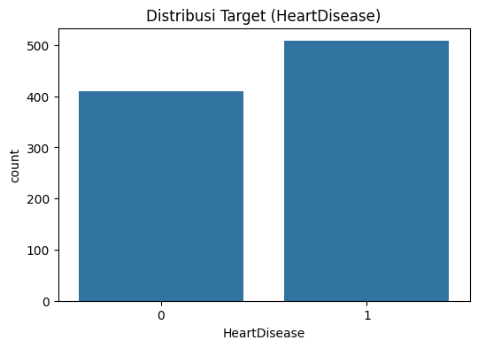

- Dataset cukup seimbang: 55% positif penyakit jantung (1), 45% negatif (0)
- Tidak diperlukan teknik handling class imbalance

#### Distribusi Usia vs HeartDisease

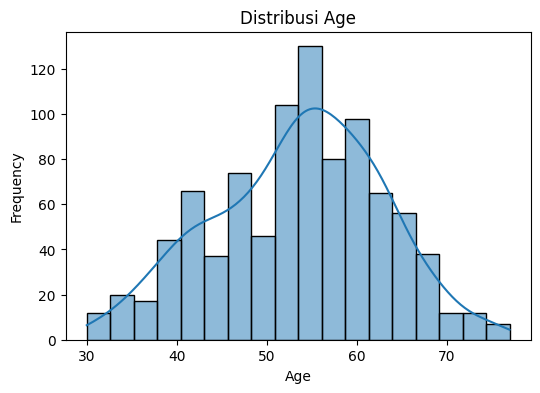

- Pasien penyakit jantung cenderung berusia lebih tua (peak 50-65 tahun)
- Distribusi bimodal menunjukkan dua kelompok risiko berbeda

#### Distribusi Kolesterol

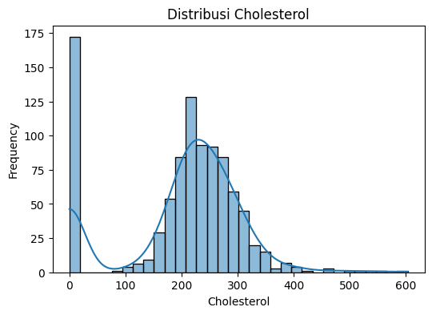

- Sebagian besar nilai antara 150-300 mg/dL (range normal-tinggi)
- Terdapat cluster di 0 mg/dL (harus di-handle sebagai missing value)

#### Distribusi Tekanan Darah (RestingBP)

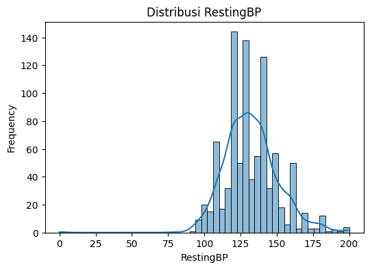

- Distribusi normal dengan mean ~132 mmHg
- Nilai ekstrim 0 mmHg dan >180 mmHg perlu ditangani

#### Distribusi MaxHR (Denyut Jantung Maksimal)

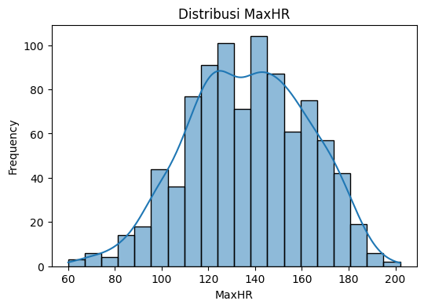
Distribusi mendekati normal dengan puncak sekitar 120-160 bpm (denyut per menit)
Rentang nilai sesuai fisiologi manusia normal (60-202 bpm)
Beberapa outlier di:
Bawah 60 bpm (kemungkinan atlet atau kondisi bradikardia)
Atas 180 bpm (aktivitas fisik intens atau takikardia)
Pola penting: Pasien dengan MaxHR rendah cenderung lebih berisiko (korelasi negatif dengan HeartDisease)

#### Distribusi Oldpeak (Depresi ST)

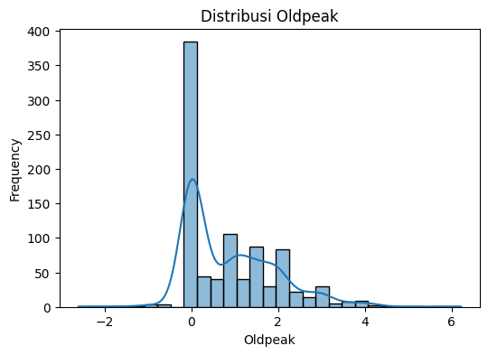

Distribusi right-skewed dengan:
75% data berada di bawah 1.5 (nilai normal)
Ekor panjang hingga 6.2 (indikasi masalah jantung serius)
Anomali:
Nilai negatif (-2.6) secara klinis tidak mungkin → perlu clipping ke 0
Lonjakan di 0 menunjukkan banyak pasien tanpa depresi ST
Signifikansi klinis:
Nilai >1.5 berkorelasi kuat dengan penyakit jantung
Parameter ini menjadi prediktor terkuat berdasarkan analisis korelasi

### Analisis Fitur Kategorik

#### ChestPainType vs HeartDisease

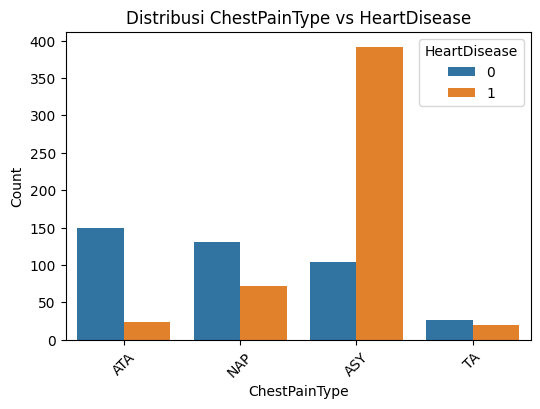

- Tipe nyeri dada ASY (asymptomatic) memiliki risiko tertinggi (79% positif)
- Tipe TA (typical angina) justru memiliki risiko lebih rendah

#### ExerciseAngina vs HeartDisease

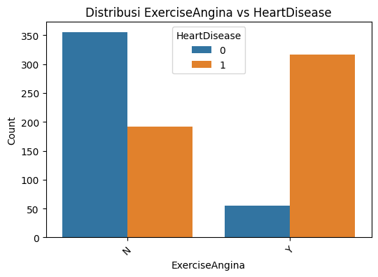

- Pasien dengan angina saat olahraga (Y) memiliki risiko 3x lebih tinggi

### Korelasi Antar Fitur

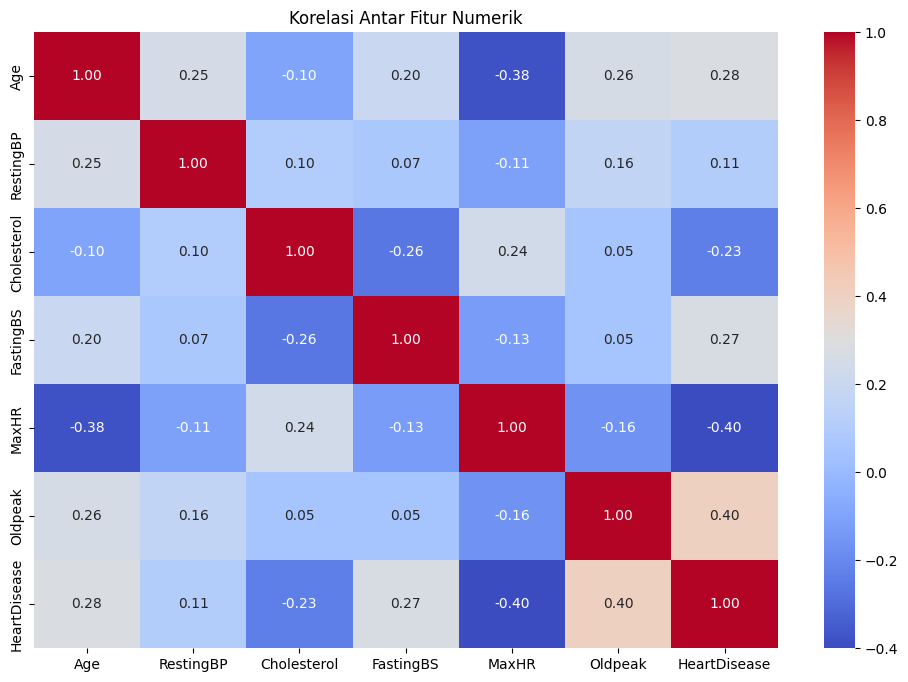

Korelasi penting:

- **Positif kuat**: Oldpeak vs HeartDisease (0.40)
- **Negatif kuat**: MaxHR vs HeartDisease (-0.40)
- **Menarik**: Age vs HeartDisease hanya 0.28

### Analisis Outlier

#### Boxplot Fitur Numerik

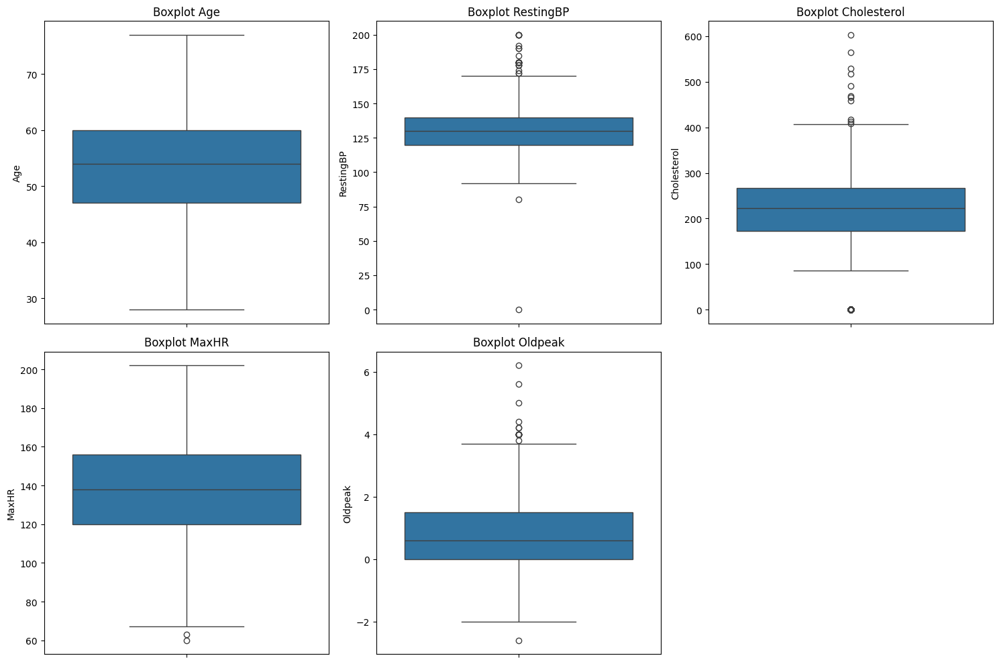

Temuan outlier:

- **Cholesterol**: 50+ nilai 0 (invalid)
- **Oldpeak**: Nilai negatif dan >4 (tidak normal)
- **RestingBP**: Nilai <80 atau >200 mmHg (ekstrim)

Penanganan:

- Nilai 0 pada Cholesterol/RestingBP → dianggap missing
- Oldpeak di-clip antara 0-4
- Nilai ekstrim lainnya dipertahankan karena masih mungkin secara medis

### Insight Utama EDA

### 📌 **Insight Ringkas Dataset Kesehatan Jantung (918 data)**

1. **Usia Pasien:**
   Rata-rata usia adalah **53,5 tahun**, mayoritas antara **47–60 tahun**, menunjukkan fokus pada kelompok usia paruh baya.

2. **Tekanan Darah & Kolesterol:**

   - Rata-rata **RestingBP**: 132 mmHg → agak tinggi.
   - Rata-rata **Cholesterol**: 198 mg/dL, tapi ada nilai **0** → kemungkinan data kosong/salah.

3. **Detak Jantung Maksimum (MaxHR):**
   Rata-rata **137 bpm**, dengan minimum **60 bpm** dan maksimum **202 bpm** → variasi besar.

4. **Penderita Penyakit Jantung:**
   Kolom `HeartDisease` menunjukkan **\~55% pasien terdiagnosis** (mean = 0.55) → dataset agak seimbang untuk klasifikasi.

5. **Data Kategorikal:**
   Ada 5 kolom bertipe objek (seperti `Sex`, `ChestPainType`) → penting untuk encoding saat modeling.

6. **Outlier & Anomali:**

   - Nilai **0 pada RestingBP & Cholesterol** tidak logis → perlu dibersihkan.
   - Nilai **Oldpeak negatif (-2.6)** juga tidak wajar.

Berikut adalah **bagian Data Preparation untuk laporan** yang disusun sistematis dan lengkap, menyesuaikan dengan **kode preprocessing yang kamu berikan**.

---

## Data Preparation

Pada tahap ini, dilakukan serangkaian langkah untuk menyiapkan data agar dapat digunakan dalam proses pelatihan model machine learning. Teknik-teknik yang digunakan adalah sebagai berikut:

### 1. Penanganan Missing Values

Fitur `Cholesterol` memiliki nilai 0 yang dianggap sebagai data hilang (missing values). Oleh karena itu, seluruh nilai 0 pada fitur ini diubah menjadi NaN agar dapat diimputasi. Imputasi dilakukan dengan menggunakan **strategi median**, yaitu mengganti missing values dengan nilai tengah dari distribusi fitur tersebut. Proses ini penting untuk menjaga distribusi data dan mencegah bias akibat imputasi nilai rata-rata.

### 2. Penanganan Outlier

Outlier pada fitur numerik (`Age`, `RestingBP`, `Cholesterol`, `MaxHR`, `Oldpeak`) dideteksi menggunakan metode **interquartile range (IQR)**. Nilai yang berada di luar batas bawah (Q1 - 1.5*IQR) dan batas atas (Q3 + 1.5*IQR) dianggap sebagai outlier. Nilai-nilai outlier ini kemudian digantikan dengan nilai batas bawah dan batas atas (clipping) agar distribusi data tetap stabil.

### 3. Encoding Fitur Kategorikal

Seluruh fitur kategorikal (`Sex`, `ChestPainType`, `FastingBS`, `RestingECG`, `ExerciseAngina`, `ST_Slope`) diubah menjadi bentuk numerik agar dapat digunakan oleh model machine learning.

- **One-Hot Encoding** digunakan pada fitur-fitur ini untuk menghasilkan kolom-kolom dummy baru, dengan penghilangan salah satu kolom sebagai referensi (**drop_first=True**).
- Hasilnya, dataset menjadi memiliki kolom-kolom tambahan yang merepresentasikan kategori, misalnya `Sex_M`, `ChestPainType_ATA`, `FastingBS_1`, dll.

### 4. Pembagian Data (Train-Test Split)

Setelah proses encoding, data dibagi menjadi dua bagian:

- **Data Latih (Training set):** 80%
- **Data Uji (Testing set):** 20%
  Pembagian dilakukan dengan fungsi **train_test_split** dari `scikit-learn` dan parameter `random_state=42` untuk memastikan hasil yang konsisten. Teknik **stratified sampling** digunakan dengan parameter `stratify=y` untuk menjaga proporsi kelas target (`HeartDisease`) di data latih dan data uji.

Hasil split data:

- Dimensi data training: `(X_train.shape)` untuk fitur dan `(y_train.shape)` untuk label.
- Dimensi data testing: `(X_test.shape)` untuk fitur dan `(y_test.shape)` untuk label.

### 5. Standarisasi Fitur Numerik

Fitur numerik (`Age`, `RestingBP`, `Cholesterol`, `MaxHR`, `Oldpeak`) memiliki skala yang berbeda. Oleh karena itu, dilakukan standarisasi menggunakan **StandardScaler**, yang mentransformasikan data ke skala standar (rata-rata 0, standar deviasi 1).

- **Scaler** dilatih pada data latih (`fit_transform`) dan diterapkan pada data uji (`transform`) untuk mencegah data leakage.

### 6. Dataset Siap untuk Pemodelan

Setelah seluruh tahapan di atas, dataset memiliki bentuk akhir:

- Fitur numerik telah distandarisasi.
- Fitur kategorikal telah diencoding menjadi variabel dummy.
- Target (`HeartDisease`) telah dipisahkan dari fitur.
- Data telah terbagi menjadi data latih dan data uji.

Dengan demikian, data siap digunakan untuk pelatihan dan evaluasi model machine learning.

---

Berikut adalah bagian **Modeling** untuk laporan yang sistematis dan menyelaraskan dengan kode yang kamu berikan:

---

## Modeling

Pada tahap ini, dilakukan pembangunan model machine learning untuk memprediksi variabel target `HeartDisease`. Proses modeling meliputi inisialisasi, pelatihan (training), dan evaluasi model.

### 1. Inisialisasi Model

Model yang digunakan adalah **Logistic Regression**, yang merupakan salah satu model klasifikasi biner yang sederhana namun efektif. Model ini dipilih karena interpretasinya yang baik dan performanya yang memadai untuk dataset ini.

- Parameter **max_iter=1000** digunakan untuk memastikan model memiliki cukup iterasi untuk konvergen.
- Parameter **random_state=42** digunakan untuk menjaga konsistensi hasil.
- Parameter **class_weight='balanced'** digunakan untuk menangani kemungkinan ketidakseimbangan kelas pada target `HeartDisease`, dengan memberi bobot lebih pada kelas minoritas.

### 2. Training Model

Model Logistic Regression dilatih menggunakan data latih (`X_train`, `y_train`). Proses ini dilakukan dengan fungsi `fit()` pada model.

- Model mempelajari pola hubungan antara fitur-fitur (`Age`, `RestingBP`, `Cholesterol`, `MaxHR`, `Oldpeak`, dan fitur dummy kategorikal) dengan target `HeartDisease`.
- Proses training ini menghasilkan parameter model (koefisien dan intercept) yang digunakan untuk prediksi pada data baru.

### 3. Prediksi

Setelah model dilatih, dilakukan prediksi pada data uji (`X_test`) menggunakan dua metode:

- **Prediksi Kelas (`y_pred`):** Prediksi kelas biner (0 atau 1) untuk `HeartDisease` berdasarkan fitur pada data uji.
- **Probabilitas Kelas (`y_proba`):** Probabilitas prediksi untuk kelas positif (1) dari `HeartDisease`. Probabilitas ini dapat digunakan untuk evaluasi berbasis threshold (misalnya ROC-AUC) atau interpretasi yang lebih fleksibel.

---

## Evaluasi Model

Setelah model Logistic Regression selesai dilatih dan menghasilkan prediksi, tahap selanjutnya adalah evaluasi performa model. Evaluasi dilakukan dengan beberapa metrik dan visualisasi untuk memberikan gambaran lengkap mengenai kemampuan model.

### 1. Akurasi (Accuracy)

Akurasi adalah proporsi prediksi yang benar dibandingkan dengan total prediksi yang dilakukan. Metrik ini memberikan gambaran umum tentang seberapa baik model memprediksi kelas target.

$$
\text{Accuracy} = \frac{\text{Jumlah Prediksi Benar}}{\text{Total Prediksi}}
$$

Hasil akurasi untuk model ini:

```
Accuracy: 0.8804
```

### 2. Classification Report

Classification report memberikan metrik yang lebih rinci, yaitu:

- **Precision:** Proporsi prediksi positif yang benar.
- **Recall (Sensitivity):** Proporsi aktual positif yang berhasil dikenali.
- **F1-score:** Harmoni antara precision dan recall.
- **Support:** Jumlah sampel aktual untuk setiap kelas.

```
Classification Report:
              precision    recall  f1-score   support

           0       0.85      0.89      0.87        82
           1       0.91      0.87      0.89       102

    accuracy                           0.88       184
   macro avg       0.88      0.88      0.88       184
weighted avg       0.88      0.88      0.88       184
```

### 3. Confusion Matrix

Confusion matrix menampilkan distribusi prediksi model terhadap kelas aktual. Visualisasi ini memudahkan analisis kesalahan model:

- True Positives (TP)
- True Negatives (TN)
- False Positives (FP)
- False Negatives (FN)

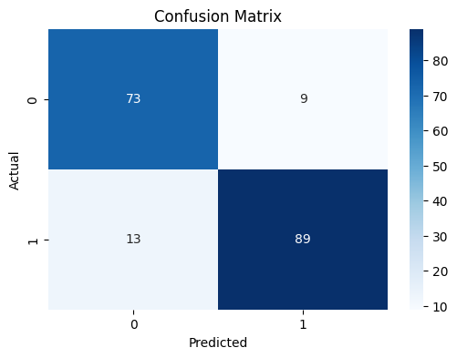

### 4. ROC Curve dan AUC Score

Kurva ROC (Receiver Operating Characteristic) menunjukkan trade-off antara True Positive Rate (Recall) dan False Positive Rate. Area Under the Curve (AUC) memberikan skor agregat performa model:

- AUC mendekati 1: performa sangat baik.
- AUC mendekati 0.5: performa setara tebak acak.

$$
\text{AUC Score} = 0.93
$$

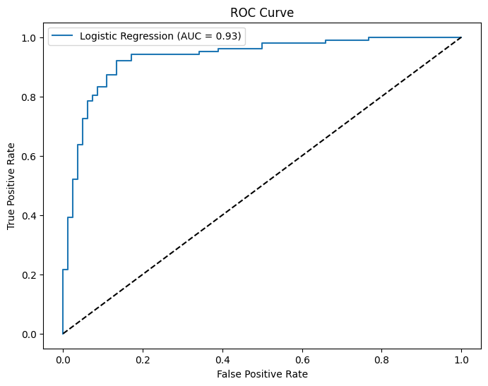

### 5. Feature Importance

Model Logistic Regression memberikan koefisien yang dapat diinterpretasikan sebagai **tingkat kepentingan (importance)** setiap fitur. Fitur dengan nilai koefisien absolut yang lebih besar memiliki pengaruh yang lebih signifikan terhadap prediksi.

Visualisasi menunjukkan **10 fitur teratas** yang paling berpengaruh terhadap prediksi `HeartDisease`:

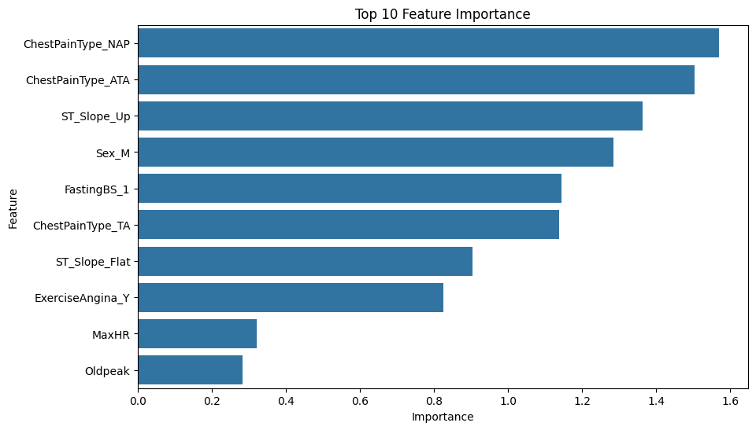

---
Berikut bagian **Inference** untuk laporanmu, disesuaikan dengan prediksi model **Logistic Regression** untuk prediksi penyakit jantung:

---

## **Inference**

Setelah model Logistic Regression selesai dilatih dan dievaluasi, dilakukan proses **inferensi** (prediksi) terhadap data baru. Tujuannya adalah untuk melihat bagaimana model dapat digunakan dalam praktik nyata untuk memprediksi risiko penyakit jantung pada individu.

### Data Uji Baru

Data uji baru yang digunakan memiliki fitur sebagai berikut:

| Fitur          | Nilai  |
| -------------- | ------ |
| Age            | 58     |
| RestingBP      | 140    |
| Cholesterol    | 289    |
| FastingBS      | 0      |
| MaxHR          | 160    |
| Oldpeak        | 1.2    |
| Sex            | M      |
| ChestPainType  | ATA    |
| RestingECG     | Normal |
| ExerciseAngina | N      |
| ST\_Slope      | Up     |

Sebelum dilakukan prediksi, data tersebut diproses menggunakan preprocessing yang sama dengan data pelatihan:

* **Encoding** untuk variabel kategorikal (`Sex`, `ChestPainType`, `RestingECG`, `ExerciseAngina`, `ST_Slope`)
* **Standarisasi** untuk variabel numerik (`Age`, `RestingBP`, `Cholesterol`, `FastingBS`, `MaxHR`, `Oldpeak`)

### Hasil Prediksi

* **Prediksi Risiko Penyakit Jantung**:

  ```
  Penyakit Jantung
  ```

* **Probabilitas Prediksi**:

  * **Probabilitas Positif (Penyakit Jantung)**: 85.73%
  * **Probabilitas Negatif (Tidak Ada Penyakit Jantung)**: 14.27%

Model memprediksi bahwa individu dengan data tersebut **berisiko mengalami penyakit jantung**, dengan tingkat keyakinan model sebesar **85.73%**.

---

### Catatan

Proses inference ini menunjukkan bagaimana model Logistic Regression yang telah dilatih dapat digunakan untuk:

* Memprediksi risiko penyakit jantung pada data individu baru
* Memberikan probabilitas keyakinan model untuk setiap kelas prediksi
* Mendukung pengambilan keputusan klinis berbasis data untuk pencegahan dan penanganan penyakit jantung.

---

